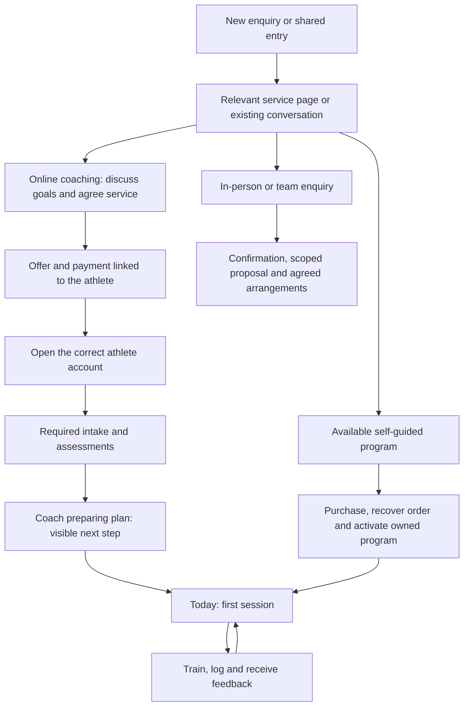

# Mini program experience review — 19 September 2026

**Recommendation:** make the mini program the place where an athlete starts and receives their coaching. Lead new enquiries toward a conversation and the right service; lead paying clients toward their next training action. Keep all three business pillars, with prominence that reflects what is actually available today.

This is a review and proposed next-version specification. No application code, customer records, payments or production configuration were changed.

## What Claude actually completed

I read the recent project conversation, its audit hand-back, the project memory notes, the current code in both repositories and the release records. I also checked the production server's current Git commit and captured the local mini program in WeChat DevTools.

| Item | Evidence-backed status |
|---|---|
| Public mini program | Last recorded public release: **2026.9.17.4**, released by Kent on 18 September at 22:12 China time. Kent confirms the mini program is live. I did not independently inspect Version Management today. |
| Next uploaded mini program | **2026.9.19**, source commit `ed16a3b`. Claude's log contains the successful upload receipt. It supersedes the intermediate .9.18 and .9.18.2 builds. The records reviewed do not establish that .9.19 has been publicly released. |
| Web app/shared API | Production server currently reports **`f591493`**, matching the latest local web commit. This includes payment-link-first collection, athlete/payer wording, coached profiles for new coaching buyers, and personal WeChat invite support. This check confirms the server revision; no new real-payment test was performed. |
| Coached-client changes in .9.19 | Extras replaces Store, public price pages redirect coached clients, priced next-phase offers are hidden, an unassigned-plan message replaces the store suggestion, invite lifecycle fixes and phone-language default are present in source. Extras was also inspected in the local simulator. |
| Earlier Me redesign | The [18 September proposal](miniprogram-me-design-2026-09-18.md) and prototype remain proposals. The current native profile still has the old grouping and large referral card. |
| Claude's deferred items | Kg/lb support; missing English fallback for some coach content; the coaching payment route; the empty Coach recommendations feature. His final audit did not resolve these. |

The source adds an important correction to Claude's summary: the mini program's **coaching signup page itself is a manual QR/“I've paid” flow**. It does not call the native payment function used by digital-program checkout. Treating it merely as a native-payment fallback understates the difference between the two purchase journeys.

Claude's business notes also say the digital store was hidden on the website because there were no real digital programs ready to sell. [The current web flag](../src/storeFlags.ts) is still false. The mini program still promotes those programs to new users. The availability of each offer needs to be consistent across both surfaces.

## How the three pillars should fit

| Pillar | Prospect's next step | Paying customer's experience |
|---|---|---|
| **Online 1:1 coaching — current priority** | Understand the service → discuss goals → receive an agreed offer/payment link | Complete intake → receive a personal plan → train → submit relevant updates/video → receive feedback → review and renew |
| **Self-guided digital programs** | Browse a genuinely available program, understand its requirements and support, then buy | Find every owned program, choose the active plan/start date, train and track progress; contact support when needed |
| **In-person training and consulting** | Enquire about individual/team needs, location and dates → receive a scoped proposal | See confirmed arrangements and any assigned training. A school/team enquiry need not become an individual athlete account until appropriate. |

The business pillars should organize the public service pages. The bottom tabs should organize the jobs a client returns to do. Three equal sales cards do not reflect the current business or the frequency of client tasks.

For now, give online coaching the primary action. Keep in-person enquiries as a clear secondary route. Show digital programs only when a real, priced, deliverable program is available; if useful, collect interest with an honest “Notify me” action. Preserve access for anyone who already owns a program.

## Recommended structure

**Public welcome:** brief explanation of the coaching service, relevant proof/sample experience, “Discuss my training” / “咨询训练”, and “I'm already a client” / “已有账户，登录”. Put other available services below. Let people understand the offer before requiring a phone number. Someone already speaking to Kent should follow their specific offer or invite directly.

**Coached clients: Today / Training / Coach / Me** — **今日 / 训练 / 教练 / 我的**.

| Destination | Its one job | Contents |
|---|---|---|
| Today | Tell me what to do next | The next necessary onboarding step or today's workout; compact wellness/workload actions where applicable; required assessment and new-feedback shortcuts; clear saved/syncing status |
| Training | Let me follow my plan | Calendar, current plan and week, workout player, demonstrations, logging and exercise-specific history. Actual active plan must be explicit. |
| Coach | Let me communicate and get feedback | Coach identity; messages; video/check-in feedback; consultation details and agreed service information when available. Keep Messages and Feedback as distinct sections under one destination. |
| Me | Let me manage my records and account | Progress & records, Assessments, My programs, My service & payments, Settings, referrals. Keep language, units and account details inside Settings. |

For digital-only customers, the third destination is **Support / 支持**, with truthful scope; do not imply they bought 1:1 coaching. In-person athletes can use the coached structure, with confirmed session information when the data exists. Keep navigation stable within each person's experience.

This updates the earlier Me proposal: its grouping of progress, assessments and settings still makes sense, but communication deserves the existing third tab for today's coaching-led business. Me can have a shortcut to that destination rather than a duplicate communication system.

**Replace Extras with Coach.** The current Extras screen has two useful contact routes and one non-functional recommendations card. Present the useful routes directly, use compact rows, and remove the placeholder. Recommendations should appear only when Kent has actually assigned one, with a clear distinction between included training and an optional paid addition.

## The intended journeys

For a Rednote lead who is already talking to Kent, avoid repeating discovery and qualification. The practical route is **conversation → agreed service → existing payment link → correct athlete account → intake → first session**. Capture the acquisition source once. Do not assume an external Rednote link can directly open every WeChat destination; use the handoff that is actually available in that conversation.

For a parent buying for a child, maintain one clearly named athlete account. Payment can come from the parent; training access belongs to the intended athlete. The latest pay page's athlete wording is a useful improvement. Show the intended athlete before binding an invite and provide recovery when the wrong WeChat account opens it. Do not silently create or switch to a second athlete.

## Gaps that matter most

### 1. A registered prospect can pay for coaching and retain the wrong experience

**Source-confirmed gap; payment was not exercised today.** [Pay-link identification](../api/payLink.ts:116) sets the coaching type only when creating a new client. If it finds an existing person, it attaches the order without updating their service type. The [payment confirmation write](../server/db/pg/productOrders.ts:526) updates orders, not the client's coaching status. WeChat self-registration creates an account without a coaching type.

Concrete journey: register in the mini program → later accept Kent's coaching offer → pay the link using the same athlete details → the existing account can still receive the non-coached UI unless someone changes it separately.

**Required outcome:** confirmed coaching purchase activates the correct service for both new and existing accounts, preserving owned digital programs and history. Registering an account must not itself mean that a paid service is active. Verify both routes, not just the new-client case.

### 2. Payment, intake and first-session readiness are disconnected

The collection endpoint creates an order with intake “Not Needed”; new pay-link clients start with intake “Not Sent”. These paths do not assign the coaching intake automatically. Home's setup banner relies on local digital-purchase flags. A client who paid through the web link can therefore land on the “coach building your plan” message without a visible required intake or a specific next step.

**Required outcome:** persist and display separate service stages: payment awaiting confirmation, intake needed, intake received, plan in preparation, plan ready, active, and renewal/paused where relevant. Use actual server records, not the presence of a local flag or an empty calendar. Show the responsible coach, the next action, and an agreed expected date where available. Do not invent a delivery deadline.

### 3. Acquisition is still aimed at a storefront

New WeChat signups explicitly land on Store; a returning account normally lands on Home. Store lists digital programs first. Its coaching card leads straight to term selection/payment details, with six months selected by default. A fresh prospect has no clear coaching enquiry step there.

**Required outcome:** new, unqualified prospects see a useful introduction and enquiry action. Qualified leads open their agreed offer. Preserve the original destination through login so a shared offer or onboarding link does not end at an unrelated Home/Store screen. Retain a direct purchase route for genuinely ready buyers and available digital products.

### 4. Extras and Me duplicate communication while obscuring assessments

Fresh native captures confirm the inert recommendation card, duplicate message/feedback entries, and a large referral block ahead of part of the personal menu. “Questionnaires” also contains tests. Home does not currently load assigned assessments to show what's due.

**Required outcome:** one Coach destination; Progress & records with clear actual-versus-estimated values; Assessments with To do and Completed; a small referral entry with accurate product eligibility. Keep assessments discoverable from Today when action is required. Do not let referral wording imply that a digital-store discount applies to individually agreed coaching fees.

### 5. No-session, rest-day and loading states are being conflated

Home renders the rest-day card whenever there is no workout today, even when there is no plan at all; its plan-preparation explanation appears farther down. “Your coach is building your plan” is inferred from an empty workout list, not a recorded preparation status. Unknown client type still behaves like a digital customer while profile calls fail or remain unresolved.

**Required outcome:** distinct screens for “finish intake”, “plan being prepared”, “plan starts on [date]”, actual rest day, completed plan, and failed refresh. Loading/unknown service type should preserve a known cached experience or show a neutral retry state. It must not imply someone needs to purchase again.

### 6. Recovery and ownership need a permanent home

The mini program has no registered Orders/My purchases destination. Digital onboarding uses local purchase flags and one active-program ID; Profile exposes one purchased-program link only for non-coached users. The manual coaching signup stores its in-progress order in component state and sends its completion button to Login.

**Required outcome:** My service & payments shows the user's existing order and real confirmation status, with resume/help; My programs contains every owned item, including for coached clients. A restart, device change, cancelled payment or delayed confirmation must not require paying again or reconstructing the purchase. Resume the same order and correct onboarding stage.

### 7. Coach feedback needs exact destinations and truthful status

The inbox combines notification, wellness and video sources. Wellness feedback opens the generic check-in page; video feedback has no source-item destination. Some feedback is always marked read. The direct-message page is asynchronous correspondence, not live chat.

**Required outcome:** tap a reply and open that submission/video with its feedback. Show unread counts only when the read model is reliable. State the agreed response window rather than suggesting an immediate reply. Surface the latest relevant feedback on Today without making the athlete search several menus.

### 8. English training content deserves higher priority than cosmetic polish

Claude described some missing English fallback as cosmetic. If it hides an exercise name or coaching instruction, it affects delivery. Fix bidirectional content fallback before relying on the app for the US athlete. The fresh Chinese calendar also mixes translated exercise names with “Strength”, “Core” and “45 sec”; finish the same-language presentation across labels and prescriptions. Add kg/lb when needed, converting display/input correctly while preserving stored values. Changing language must keep the person on their current screen; Profile currently relaunches Home.

## Delivery order

**First batch — current online clients and new Rednote conversions:** existing-account coaching activation; payment-to-intake handoff; server-backed onboarding status and next action; Coach in place of placeholder Extras; due assessments on Today; truthful new-client/no-plan/error states; training-content fallback. Keep the working workout player, drafts and save queue intact.

**Second batch — continuity and retention:** consolidate Me; exact feedback links and reliable unread state; service/order recovery; renewal with the person's agreed terms; bilingual navigation continuity; parent/athlete recovery. Use the existing payment infrastructure where appropriate rather than maintaining two confusing coaching checkout experiences.

**Third batch — activate the other pillars:** publish only complete digital offerings with an owned-program library and recovery; improve the in-person brief with explicit location, dates and service type. Build booking, a recommendation engine or a resource library only when the real service needs them. A renamed empty tab is not sufficient value.

Do not reimplement Claude's completed invite and route fixes or repeat the old launch audit's resolved defects. Preserve compatibility with the public build while a newer mini program waits for review.

## Acceptance before calling the flow ready

| Walkthrough | What must be true |
|---|---|
| New Rednote lead | Understands the service and finds the relevant next step without unnecessary registration or a misleading store detour |
| Already registered → coaching payment | Same account becomes coached after confirmed payment; existing history and products survive |
| New buyer → payment → reopen | Order, intake and plan status recover from the server without duplicate purchase or an unexplained empty calendar |
| Parent pays, child trains | Correct athlete name throughout; intended WeChat binds; wrong-account and expired-invite cases have useful recovery |
| Intake needed / plan being built / future start / rest day | Four distinct, accurate next-action states |
| Active coached athlete | Opens today's session directly, logs without loss, finds relevant feedback and reaches the coach easily |
| Offline save / app close / reconnect | Saved locally, syncing, server-confirmed and failed are visibly distinct; no duplicate sets |
| Assessment or video feedback | Due work is discoverable; a reply opens the exact item; no invented unread/complete state |
| Digital-only and coaching-plus-digital | Every owned program remains accessible; support scope and active plan are clear |
| In-person/team enquiry | Submission is acknowledged with a useful next step; no fictitious appointment or instant coaching account is implied |
| Chinese/English and US usage | Content remains readable, language changes preserve location, training dates/units are understood, video works on the actual connection |

Run these on WeChat iOS and Android, including a narrow screen, keyboard open, app restart and weak connection. These are acceptance requirements, not tests completed by this review. Measure enquiry-to-conversation, offer-to-confirmed-payment, payment-to-intake, intake-to-first-session, weekly training completion and overdue feedback. Use a consistent source/campaign field; keep sensitive free-text intake out of analytics.

## Evidence and limits

- Current mini source: `ed16a3b`; current web source and production server revision: `f591493`.
- Claude session: `C:/Users/kentb/.claude/projects/c--Users-kentb-nolimit-training/717ca1e4-e2e0-4419-a8a3-195e84837e02.jsonl`. The final audit summary is at line 2388; the upload receipt is at line 2385. Relevant memory notes: `project_wechat_miniprogram.md`, `project_coaching_flow.md`, `project_store_hidden.md`, and `project_business_model.md`. Older entries contain superseded architecture/payment information; current source and recent receipts take precedence.
- Fresh local DevTools captures: [Today](../deliverables/mini-ux-2026-09-19/current-home.png), [Training](../deliverables/mini-ux-2026-09-19/current-calendar.png), [Extras](../deliverables/mini-ux-2026-09-19/current-extras.png), [Me](../deliverables/mini-ux-2026-09-19/current-profile.png), [Assessments](../deliverables/mini-ux-2026-09-19/current-forms.png), [Messages](../deliverables/mini-ux-2026-09-19/current-message.png), and [Feedback](../deliverables/mini-ux-2026-09-19/current-inbox.png). They use the established QA fixture and show the local candidate, not proof of the published build. No messages or training submissions were sent. The original simulator page was restored.
- This was source review, native visual inspection and a read-only server-version check. It was not a real-payment rehearsal, real-device certification, full regression suite or load test. The experience cannot yet be called flawless; the acceptance matrix above defines the remaining proof.
