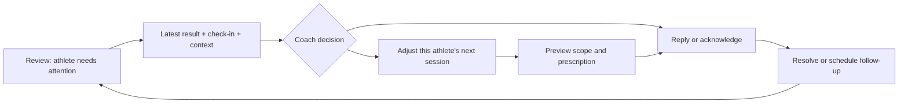

# Mobile coaching audit: TrainHeroic and Everfit benchmark

23 September 2026 · NX LIMIT web release `10f5f27` · Audit and recommendations

**Implementation update:** release A's foundations are implemented in the [release A receipt](mobile-coaching-release-a-2026-09-23.md). Release B's daily Review queue, athlete summary, training-based attention signals and connected session history are implemented in the [release B receipt](mobile-coaching-release-b-2026-09-23.md). Release C adds shared prescription controls, reusable exercise blocks, week-copy progression and simpler calendar/library navigation in the [release C receipt](mobile-coaching-release-c-2026-09-23.md). Release D's web reliability, reply recovery, China-time calendar and language work are recorded in the [release D receipt](mobile-coaching-release-d-2026-09-23.md); physical-device and native mini-program validation remain open. This audit's observations below describe the original baseline.

**Assessment:** NX LIMIT has a substantial coaching feature set. The remaining gap is the reliability and continuity of everyday coaching: finding the athlete who needs attention, understanding their results, changing the right session, replying, and returning to the queue. Several concrete defects should be fixed before another broad visual redesign.

The design direction remains Kent's: the same coaching structure on desktop and phone, and the mini program as the reference for the athlete experience. Keep the existing brand and navigation. Improve the shared workflows and components.

## What was inspected

- Current live coach app at 390 × 844: roster, athlete overview, calendar, saved-workout assignment preview, completed workout, calendar editor, Review and programming library. Production reads only; no assignments, replies or training data were saved.
- Matching local production build at 360px and 1440px, using captured API responses; additional 390px checks for check-in positioning, timed prescriptions and program drafting. Chinese roster inspected at 360px.
- Created a disposable program in browser memory, added a day/exercise/note, and reloaded after accepting the existing leave warning. Checked whether a recoverable draft remained.
- Reviewed the code behind calendar editing, review, messaging, program state, progress, alternates and calendar actions.
- Compared official product documentation, including TrainHeroic's mobile coaching guidance. Everfit's Check-in Dashboard is explicitly a **web beta**; it is a workflow reference, not evidence that all those features exist in its native coach app.

Evidence is in [the local audit folder](../deliverables/mobile-coaching-benchmark-2026-09-23/). [Open the visual evidence board](../deliverables/mobile-coaching-benchmark-2026-09-23/review.html).

Limitations: competitor accounts were not tested hands-on; no physical iPhone/Android keyboard, background-app termination, real push delivery or native WeChat parity was certified. The initial live capture completed its screens but its runner encountered a request-disposal error during teardown; local checks completed cleanly. No application page errors or production writes were recorded. Screen counts and client state are a dated snapshot.

## Useful patterns from the reference products

| Reference | Documented behavior | Implication for NX LIMIT |
| --- | --- | --- |
| [TrainHeroic Coach Home](https://support.trainheroic.com/hc/en-us/articles/18156740868493-Using-the-Coach-Home-Activity-Feed) | Review recent completed training, reply from the feed, and identify athletes approaching the end of their programming. Mobile supports session review and feedback. | Put actual coaching decisions above summary graphics. Show training coverage before it runs out. |
| [TrainHeroic mobile programming](https://support.trainheroic.com/hc/en-us/articles/18156764984717-For-Coaches-Creating-New-Sessions-on-Mobile) | Create sessions and circuits, retain unpublished drafts, reschedule/copy sessions, assign programs. Individual edits to an assigned session do not change its saved session template. | Make edit scope and draft/published state explicit. |
| [Everfit client insights](https://help.everfit.io/en/articles/16000596-check-in-dashboard-review-client-insights), [dashboard availability](https://help.everfit.io/en/articles/14495409-check-in-dashboard-overview-beta) | Its web beta brings adherence, check-in forms, program endings, notes and follow-up alerts into the same review workflow. | Reuse our existing data to support a decision without visiting several destinations. |
| [Everfit Inbox](https://help.everfit.io/en/articles/2972174-inbox-messaging) | Conversations, unread filtering, media and mobile voice messages; client context is available beside the web inbox. | Athlete communication needs continuity and easy access to the relevant training. |
| [TrainHeroic saved circuits](https://support.trainheroic.com/hc/en-us/articles/18170984364685-Creating-Saving-Circuits), [Everfit sections](https://help.everfit.io/en/collections/1789451-everfit-s-workout-builder) | Reusable circuits/sections sit below whole workouts in the library hierarchy. | Reuse a spring-ankle block or core circuit without copying a whole session and deleting unwanted exercises. |

These are patterns to adapt to Kent's coaching. They do not establish that either competitor is flawless or that every documented desktop tool is available on mobile.

## Preserve what already works

Coach mode stays visible; athlete preview is explicit and read-only. The roster has a direct calendar shortcut. Calendar editing returns to the athlete. Saved workouts have an assignment confirmation with athlete/date/content. Programs support day copying and week duplication. Exercise replacement, alternates, circuits, each-side prescriptions, private notes, check-in replies, form/video review, exercise history and progress already exist.

Several recommendations below improve the placement or consistency of those features. They are not requests to build them again. The loading improvement from the previous phase should also be retained.

## Priority findings

P0 = correctness, access or data-scope issue. P1 = next coaching-experience release. P2 = subsequent depth and polish. Priorities are recommendations, not implemented fixes.

### 1. P0 — A check-in can open outside the visible screen

**Observed:** on the 390px production build, opening a check-in after scrolling into Review produced an almost blank panel. The close button, athlete name and reply controls were above the viewport. Scrolling the document back to the top exposed them.

**Evidence:** [panel as opened](../deliverables/mobile-coaching-benchmark-2026-09-23/reviewdetail-390-check-in-open.png), [after scrolling to top](../deliverables/mobile-coaching-benchmark-2026-09-23/reviewdetail-390-check-in-after-scroll-top.png), [measured layout](../deliverables/mobile-coaching-benchmark-2026-09-23/check-in-layout.json). At document scroll 972px, the fixed panel started at −932px and was about 4,046px tall. Its `.rvPage` ancestor retained an identity transform from its entrance animation.

**Recommendation:** use the established overlay portal for this panel, constrain its height to the viewport, lock background scrolling, and keep close/reply actions reachable. Apply the same check to other sheets rather than adding a special margin to this one.

**Acceptance:** opening a check-in from the top, middle or bottom of a long queue always shows its header and a usable reply area. Returning restores the queue position. Verify with normal animation, a reduced viewport and the real phone keyboard.

### 2. P0 — Calendar editing still changes the shared template

**Observed:** opening Yanjun's assigned workout and choosing Edit in Builder loads its underlying saved program. The editor explicitly says changes apply wherever that session is assigned. The calendar context makes this easy to mistake for a change to just her session.

**Evidence:** [live editor](../deliverables/mobile-coaching-benchmark-2026-09-23/live-390-workout-editor.png); `openWorkoutProgramInBuilder` in `src/App.tsx` loads the program in edit mode using the assigned workout's week/day.

**Recommendation:** default calendar edits to **This athlete, this session**. Offer a separate **Edit library template** action, with an affected-assignment summary before any propagation. Preserve completed-session prescriptions/history. Exercise-library cues need the same scope clarity: **Exercise guidance for everyone** versus **Instructions for this workout**.

**Acceptance:** changing Yanjun's load or hold duration leaves other athletes, the library and completed sessions unchanged unless the coach explicitly chooses the broader operation. Verify the actual write behavior, not just the wording.

### 3. P0 — A timed hold has conflicting summaries

**Observed:** Yanjun's Bulgarian split squat is correctly described as a 30-second isometric hold on each side, and its logging inputs are time-based. However, the detailed workout review still shows **REPS 8**; the overview says **30 / round** without a time unit. The assignment preview correctly says **30 sec · each side**. Pogos also have a simple `3 × 20` summary while their instructions describe 20, 15 and 12 jumps.

**Evidence:** [captured review text](../deliverables/mobile-coaching-benchmark-2026-09-23/live-390-completed-workout.txt), [assignment preview](../deliverables/mobile-coaching-benchmark-2026-09-23/live-390-assignment-preview.png), `src/WorkoutPlayerModal.tsx` reads the older notes tracking type/reps field for the detailed prescription grid.

**Recommendation:** one prescription formatter based on structured set data and tracking fields across calendar, builder, assignment, review and athlete preview. Use `2 rounds · 30 sec/side · isometric hold`; show varying sets as `20 / 15 / 12 reps`. Present circuit membership, order and rest consistently.

**Acceptance:** every relevant screen agrees for rep ranges, varying sets, time, distance, each-side work and circuits. Test the actual mini program separately. This finding does not establish that its circuit execution is currently broken.

### 4. P1 — Coaching drafts need recovery

**Observed:** a new program/day/exercise/note existed in the editor, and the application warned before leaving. After accepting reload, it returned to the roster with no recoverable program. The current guard helps deliberate navigation; it is not durable storage.

**Evidence:** [unsaved program](../deliverables/mobile-coaching-benchmark-2026-09-23/program-390-unsaved-program.png), [after reload](../deliverables/mobile-coaching-benchmark-2026-09-23/program-390-after-draft-reload.png); builder content is held in React state. Athlete workout-log draft recovery is a separate existing feature.

**Recommendation:** recoverable coach drafts with `Saved on this device`, `Synced`, `Not synced` and `Published` states that mean what they say. Separate saving a draft from making training visible to athletes. Add undo for exercise deletion/reordering. Begin with reliable local recovery, then server drafts/version conflict handling for phone-to-desktop continuation.

**Acceptance:** refresh, reconnect and return to the same draft without publishing it. Keep drafts scoped to coach, athlete and program; recover after failed saves; never silently overwrite a newer version.

### 5. P1 — Review should lead with the next coaching action

**Observed:** the live Review screen showed 62 open items, including 45 missed tasks. The hero and seven summary cards consumed nearly the first viewport before an actionable item. Old entries and admin enquiries appeared alongside coaching work.

**Evidence:** [live Review](../deliverables/mobile-coaching-benchmark-2026-09-23/live-390-review.png). Existing queues and replies are useful; presentation and prioritization are the gap.

**Recommendation:** within the existing Review destination, use compact filters and an ordered list: athlete waiting for a reply, new training/check-in to review, programming ending, then older follow-ups. Show why an item needs attention, its age, and its next action. Support reviewed/resolved/snoozed state and history. Surface admin/order work through a separate filter; retain access.

**Acceptance:** the first actionable item appears without scrolling on 390px. Finishing a review advances to the next item and updates the badge. A resolved or snoozed item does not repeatedly return as urgent. Audit legacy/test backlog separately before making any data changes.

### 6. P1 — The athlete overview needs a coaching summary

**Observed:** opening Yanjun leads primarily to upcoming tasks. Progress and private notes exist elsewhere, but the opening screen does not combine the latest completed session, latest check-in, outstanding feedback and next training decision.

**Evidence:** [athlete overview](../deliverables/mobile-coaching-benchmark-2026-09-23/live-390-athlete-overview.png), `src/PortalHome.tsx` reuses its upcoming-task panel for the coach activity view.

**Recommendation:** a compact coaching summary with latest result, check-in change, next session, remaining programmed days and one outstanding action. Provide Review last workout, Adjust next session and Follow up. Keep Progress and Profile & Notes as the detailed destinations; make them discoverable beyond the horizontally scrolling tab strip.

**Acceptance:** answer “How did she do, what needs my attention, and what's next?” in the first screen. Missing data must stay unknown, not look like poor adherence or low readiness.

### 7. P1 — Athlete attention signals need clearer meaning

**Observed:** “Needs contact” is currently a missing email/phone check, not “this athlete needs a coaching follow-up.” Inactivity is based on login; an athlete can have a recent completed session while showing “No login yet.” The no-plan check also depends on an empty program-name field, so it is not a dependable upcoming-program-end warning.

**Evidence:** `clientNeedsContact`, `matchesTriage`, `clientNeedsProgramming` and `clientEngagement` in `src/App.tsx`; roster capture shows these different signals together.

**Recommendation:** label missing contact details as account setup. Base training activity on actual session/check-in records across web and mini program. Derive programming coverage from future scheduled training and display its end date. Define paused athletes and future sessions consistently in adherence calculations.

**Acceptance:** an athlete who trained yesterday cannot be marked inactive solely because a web-login field is missing. An athlete with a populated old program name and no future training still gets a programming warning.

### 8. P1 — Calendar and navigation need less repeated work

**Observed:** Wednesday was selected, but the phone week view still started with Monday and Tuesday. Date controls occupy substantial height. Copy/cut/paste already exist through long-press; they are not obvious controls. Programming also takes a Library submenu step.

**Recommendation:** retain Week / Month / Full on both devices, automatically position the selected date on entry, and preserve it on return. Put visible Move, Copy, Edit and Review actions in a session menu; keep long-press as a shortcut. Let Library open its last-used section directly, with Exercises / Programs / Sessions / Forms / Tests as clear shared destinations. Give athlete switching a quick search without losing the current calendar date.

**Acceptance:** the selected day's first session is visible on entry. Copying or moving requires no gesture discovery. Browser/app back returns to the correct athlete/date/filter. Check the mobile menu with real touch: the current hover CSS can keep a flyout visible in browser emulation after selection.

### 9. P1 — Use one exercise editor and one visual language

**Observed:** the saved-workout editor uses section badges, a statistics bar, Show/Edit pills and a gold Save action. A new phone program uses a different card, exercise menu, day-review step and black Save action. Both work in places, but the same coaching task feels different depending on entry point. The library has multiple nested filter containers; a large Refresh button competes with finding a program.

**Evidence:** [saved-workout editor](../deliverables/mobile-coaching-benchmark-2026-09-23/live-390-workout-editor.png), [new-program prescription](../deliverables/mobile-coaching-benchmark-2026-09-23/program-390-exercise-prescription.png), [settled library](../deliverables/mobile-coaching-benchmark-2026-09-23/local-390-program-library.png).

**Recommendation:** shared exercise rows and prescription controls, adapted to width. One header with title/scope/save state; one primary bottom action; consistent menus and sheets. Use a restrained 8px spacing scale, approximately 14–16px body text, 12px minimum secondary labels and 44–48px action targets as product targets. Keep information-heavy charts/details behind purposeful disclosure. Preserve the same concepts and save semantics on desktop.

**Acceptance:** the first exercise is visible without passing setup panels; editing load, duration, notes and a circuit uses the same vocabulary from every entry point. Week/Month/Full currently measure about 32px tall; enlarge interactive areas without adding large banners. Verify long Chinese names and keyboard focus on physical phones.

### 10. P1/P2 — Connect results, feedback and programming

**Observed:** exercise history, wellness trends, form-video review, direct message replies and check-in replies exist, but are separate. The direct-message API currently models an athlete message plus a coach reply; it is not a full ongoing thread. The builder does not expose the athlete's previous performance beside the set being prescribed.

**Recommendation:** first bring Last performed, actual load/reps/time and the relevant comment into athlete-specific programming. Add an athlete activity timeline joining completed training, check-ins, video feedback and coach decisions. Make each item open its source. Then add coach-initiated conversations, reply drafts, follow-up state and media/voice responses where they reduce typing. Keep a clear route to WeChat when that is where the conversation occurs; don't imply external messages are synchronized without an integration.

**Acceptance:** review a result, see its context, adjust the next session, reply and return without re-finding the athlete. Logged facts, coach notes and athlete messages remain clearly distinguished. No automated training changes are required.

### 11. P2 — Reuse the building blocks of Kent's coaching

**Observed:** whole sessions, programs, exercises, day copying, week duplication and exercise alternates already exist. A first-class reusable multi-exercise block library was not found in the inspected builder paths. Desktop week duplication also offers target weeks and percentage adjustment, while mobile's quick duplicate goes to the next week without those choices.

**Recommendation:** save and insert named warm-ups, ankle/spring blocks and core circuits, including order, rounds, rest and bilingual notes. Keep favorites/recently used near search. Offer the same advanced progression/copy choices on phone through an optional sheet. Add a compact previous-week comparison when progressing a block.

**Acceptance:** insert a saved core circuit without reconstructing links/rest. Reusing it creates the intended independent copy or explicit linked instance. Athlete-specific changes do not silently alter the saved block. Quick copy stays quick; advanced options stay discoverable on both devices.

### 12. P2 — Finish language, travel and connection behavior

**Observed:** Chinese roster controls are mixed with English headings, statuses and attention labels. Browser-local dates define Today and several overdue calculations. The new startup performance work helps, but does not establish offline coach editing or reliable notification delivery.

**Recommendation:** complete coaching-interface translation and distinguish athlete-content language from coach-interface language. Define an athlete/coaching calendar timezone so Japan travel does not move the working date around midnight. Show last-updated/sync/error state, retain successful reads during retry, and prevent duplicate saves after reconnect. Make coach notification preferences and source links clear before adding another delivery channel.

**Acceptance:** the same assignment date and overdue status agree on phone, desktop and mini program across timezone boundaries. English/Chinese screens have consistent terminology. Network loss does not turn cached data into zeros or a failed save into “Saved.” Native push and background recovery require separate device verification.

## Proposed daily coaching flow

Keep Clients / Library / Review / More familiar. Improve Review as the operational queue and Clients as the athlete workspace. Within an athlete, keep Overview / Calendar / Programs / Progress / Profile & Notes, with clearer access to feedback. Athlete preview continues to share Today / Training / Coach / Me with the web athlete experience, aligned with the mini program.

For the three business pillars, prioritize this online-coaching loop now. Digital-program buyers need support and delivery rather than automatic daily coaching alerts. In-person/team clients can reuse the calendar, roster and review structure as that service grows. Store/admin tools remain accessible without occupying the main coaching screen.

## Delivery order and completion tests

| Release slice | Deliverable | Exit condition |
| --- | --- | --- |
| A — Trust and editing | Check-in overlay repair; consistent prescriptions; per-session edit scope; recoverable drafts. | Review from a scrolled queue; correct hold/circuit display everywhere; isolated athlete edits; recover after refresh/offline failure. |
| B — Daily coaching | Action-first Review; athlete summary; reliable attention signals; connected results/feedback. | Complete “review → adjust → reply → resolve” on a phone while retaining context. |
| C — Consistent programming | Shared editor; calendar/date navigation; library simplification; reusable blocks; parity for advanced copy/progression. | Same session task on desktop and phone has matching scope, data, actions and result. |
| D — Operational polish | Translation, timezones, reconnect/notification behavior and physical-device QA. | Real iPhone/Android + WeChat checks; keyboard, background/resume, retry and dated assignments behave correctly. |

Measure task time, actions and errors for five repeatable tasks: review a check-in; adjust one athlete's hold without changing anyone else; assign a saved session; copy/progress a week; recover an interrupted draft. Keep separate results for 360px, 390px and desktop. A task counts as successful only after the saved result and its scope are verified.

The next investment should be release A, followed by B and a shared component pass. Nutrition tracking, community feeds, a marketplace expansion, AI-generated programs and a new native coach app are lower priorities for the current online-coaching operation.
